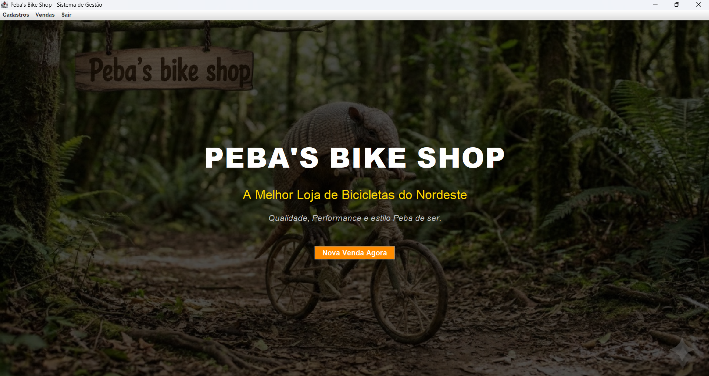
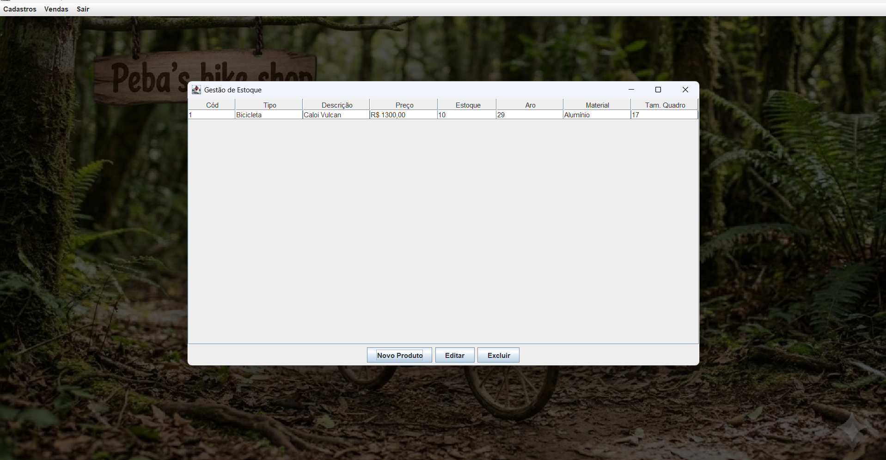
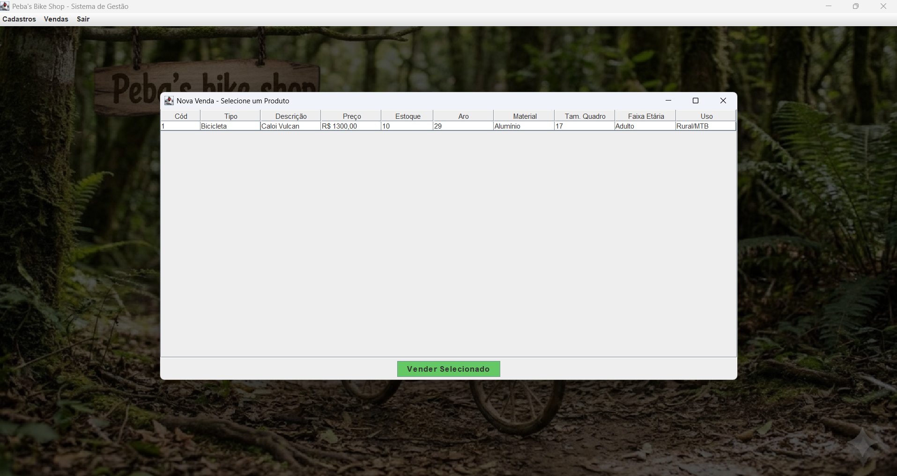
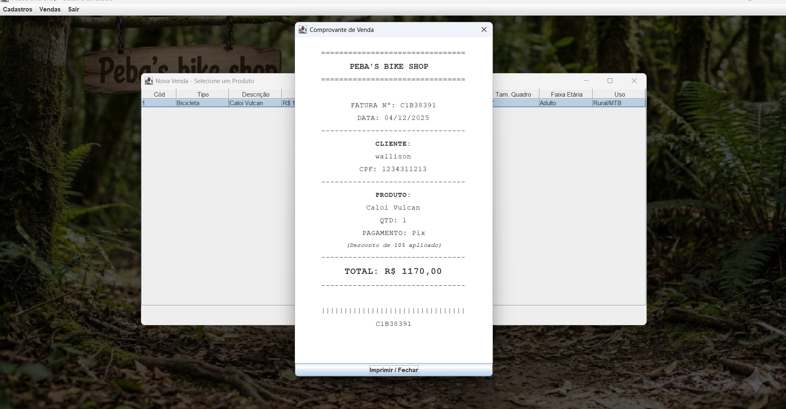

# 🚲 Peba's Bike Shop - Sistema de Gestão

> "Qualidade, Performance e estilo Peba de ser."


## 📖 Sobre o Projeto

Este projeto foi desenvolvido como requisito avaliativo para a disciplina de **Programação Orientada a Objetos (POO)**. 

O sistema consiste em uma aplicação Desktop em **Java Swing** para o gerenciamento completo de uma loja de bicicletas. O foco principal foi a implementação de uma arquitetura **MVC (Model-View-Controller)** robusta, utilizando persistência de dados em arquivos binários (Serialização) para simular um banco de dados local.

---

## 📸 Screenshots

| Tela Inicial | Gestão de Estoque |
|:---:|:---:|
|  |  |

| Nova Venda | Comprovante Fiscal |
|:---:|:---:|
|  |  |

---

## 🚀 Funcionalidades Principais

### 📦 Gestão de Estoque
* **Cadastro Polimórfico:** Diferenciação entre **Bicicletas** (com atributos como Aro, Material, Faixa Etária, Uso) e **Peças** (Quadros, Rodas, etc).
* **Controle de Estoque:** Alertas visuais e bloqueios quando o estoque atinge o nível mínimo.
* **Código Automático:** Geração sequencial de IDs para produtos.

### 💰 Sistema de Vendas
* **Carrinho de Compras:** Seleção de cliente e produtos com verificação de disponibilidade em tempo real.
* **Regras de Negócio:**
    * Desconto automático de **10% para pagamentos via Pix**.
    * Validação de datas (impede vendas com datas futuras).
* **Faturamento:** Geração de comprovante fiscal visual e salvamento de histórico em arquivos `.txt` individuais.

### 👥 Gestão de Clientes
* CRUD completo (Criar, Ler, Atualizar, Deletar) de clientes.
* Persistência automática dos dados.

### 📊 Métricas e Relatórios
* Dashboard com indicadores de desempenho:
    * Total de vendas do mês.
    * Produto mais vendido (Curva ABC).
    * Melhor cliente (baseado no volume de compras).
    * Dia com maior faturamento.
* Histórico detalhado com opção de re-impressão de faturas e estorno de vendas (devolução ao estoque).

---

## 🛠️ Arquitetura e Tecnologias

O projeto segue estritamente o padrão **MVC**:

* **Model:** Classes POJO (`Produto`, `Bicicleta`, `Cliente`, `Venda`) implementando `Serializable`.
* **View:** Telas construídas com `javax.swing` (`JFrame`, `JDialog`, `JPanel`), utilizando layouts responsivos (`BorderLayout`, `GridBagLayout`).
* **Controller:** Lógica de negócio, validações e orquestração entre a tela e os dados (`VendaController`, `RelatorioController`, etc).
* **DAO (Data Access Object):** Classe `GerenciadorDados` responsável por ler e escrever os arquivos `.dat`.

---

## 🔧 Como Executar

Pré-requisitos: **Java JDK 17+** e **Eclipse IDE** (ou outra IDE Java).

1.  **Clone o repositório:**
    ```bash
    git clone [https://github.com/SEU-USUARIO/PebasBikeShop_ProjetoPOO.git](https://github.com/SEU-USUARIO/PebasBikeShop_ProjetoPOO.git)
    ```
2.  **Importe no Eclipse:**
    * `File` > `Import` > `General` > `Projects from Folder or Archive`.
    * Selecione a pasta clonada.
3.  **Configuração:**
    * Certifique-se de que a imagem de fundo (`fundo.jpg`) está na pasta `src/imagens` (ou no `Build Path` correto).
4.  **Execute:**
    * Abra a classe `src/br/com/bikeshop/app/Main.java`.
    * Execute como Java Application.

---

## 👨‍💻 Autores

* **Thiago Leal** - *Desenvolvedor Backend & Frontend* - [GitHub](https://github.com/thiagoleal435)
* **Emerson Silva** - *Desenvolvedor Backend & Frontend* - [GitHub](https://github.com/emersontecn)

---

## 📝 Licença

Este projeto está sob a licença MIT - sinta-se à vontade para usar e modificar.
